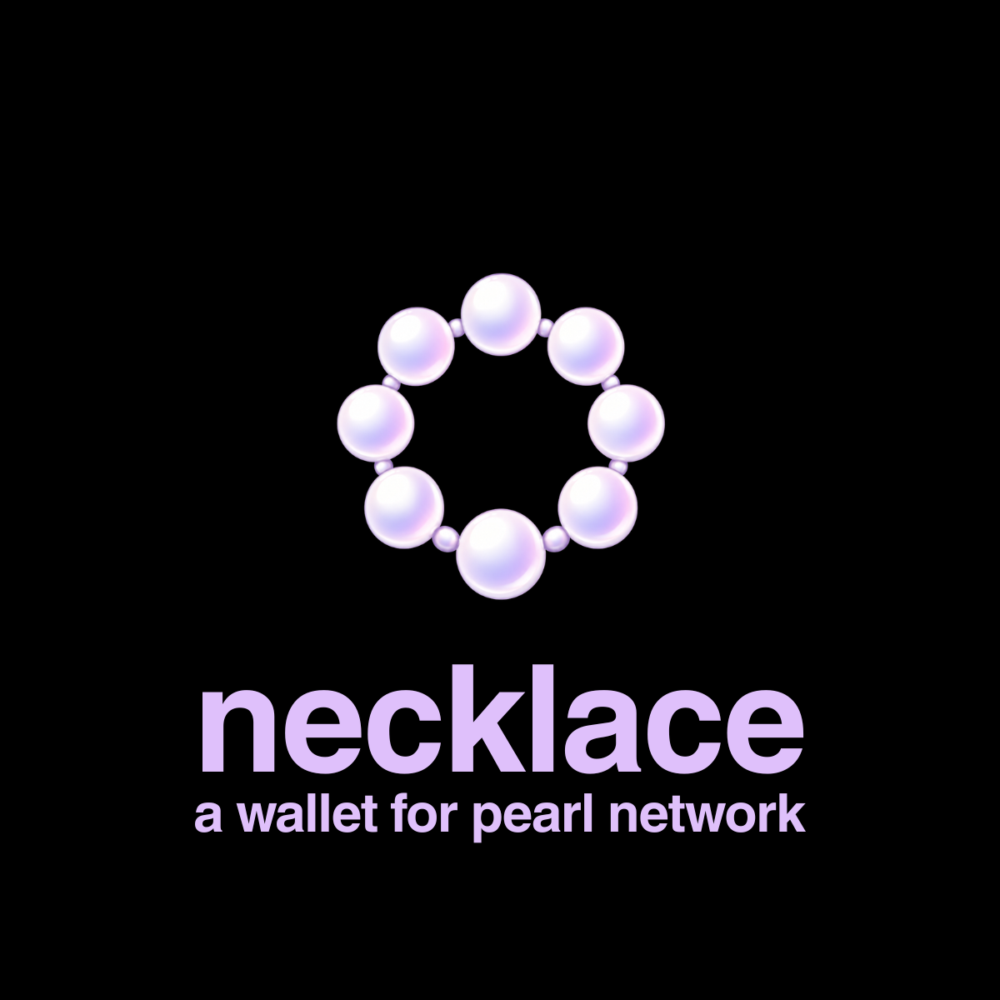
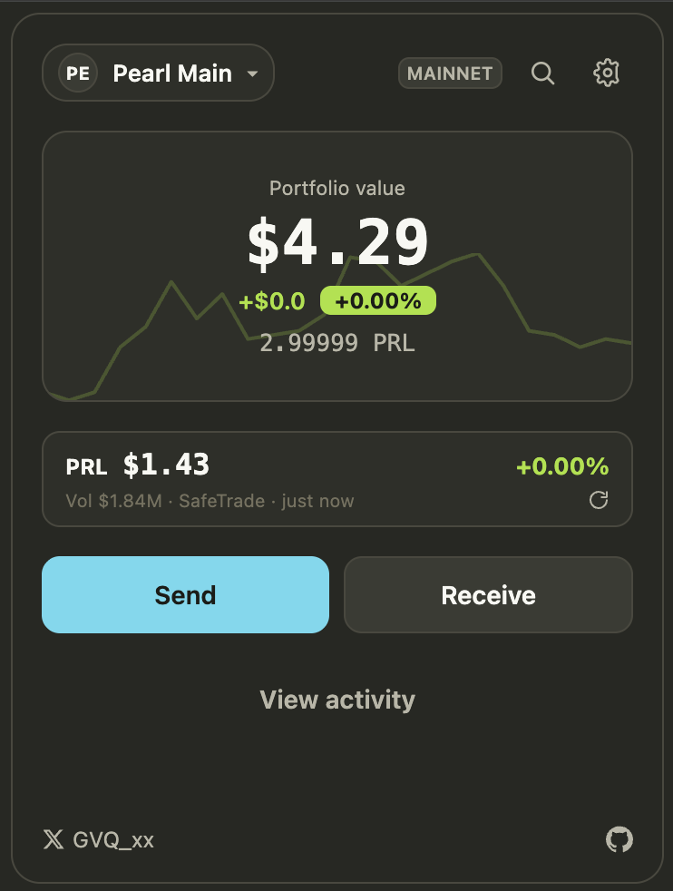

<p align="center">
  
</p>

# Necklace

An open-source, **non-custodial** Chrome (Manifest V3) wallet for **Pearl (PRL)**.

Your recovery phrase and keys are generated and encrypted **on your device** and
never leave the extension. Transactions are signed locally; only a fully-signed,
already-reviewed transaction is broadcast. The extension reads chain data and
broadcasts through a public [Pearl Blockbook](https://blockbook.pearlresearch.ai)
node, and reads the PRL price from SafeTrade — there is **no Necklace server**
that ever sees your keys, balances, or addresses.

> **Warning — self-custody software.** You alone are responsible for your
> recovery phrase. Anyone who has it can spend your funds, and no one can recover
> it for you. This software is provided **as-is, without warranty** (see
> [LICENSE](LICENSE)).

## Features

- Generate a new wallet (BIP-39 mnemonic → BIP-86 Taproot) or import one
  (mnemonic / WIF / raw key / watch-only xpub)
- Encrypted local vault (PBKDF2-SHA256 + AES-256-GCM), auto-lock timer, and
  persistent unlock across popup reopens
- Multiple independent accounts under a single password
- Send / receive PRL, with a transaction preview that shows **every output**
  before you sign
- Activity history and per-transaction detail (senders / receivers / amount / fee)
- Address lookup (read-only balance explorer) and a contacts address book
- Live PRL price, a 24-hour price sparkline, portfolio value, and Monokai
  dark / light themes

## Screenshot

<p align="center">
  
</p>

## Security model

- **Keys never leave the device.** The decrypted key exists only in the
  extension's worker memory and — for the unlock window — in
  `chrome.storage.session`, which is RAM-only. Signing always re-derives from
  your password at sign time.
- **No remote code.** A strict Content-Security-Policy means nothing is loaded
  or `eval`'d from the network. All cryptography is bundled and pinned
  byte-for-byte to Pearl's own known-answer test vectors
  (`packages/wallet-core`).
- **Minimal permissions.** `storage` plus exactly two network hosts:
  `blockbook.pearlresearch.ai` (chain) and `safetrade.com` (price).
- **Transparent fee.** The wallet adds a flat **0.1 PRL** fee as a *separate,
  visible output* (shown on the confirm screen) to a fixed, in-code address —
  never hidden, never server-controlled. See [docs/fee-policy.md](docs/fee-policy.md).

More background: [docs/threat-model.md](docs/threat-model.md),
[docs/protocol-findings.md](docs/protocol-findings.md),
[docs/blockbook-integration.md](docs/blockbook-integration.md).

## How signing works (the short version)

Pearl's everyday send/receive path is plain **BIP-340 Schnorr / Taproot
key-path** spending over secp256k1 (bech32m addresses, HRP `prl`). Necklace
implements this as an audited TypeScript port (`@noble/curves`,
`@scure/btc-signer`) in `packages/wallet-core`, verified against Pearl's KATs.
Amounts are handled as `bigint` Grain (1 PRL = 100,000,000 Grain) — never
floats. Pearl's optional post-quantum (XMSS) signing is **not** on this path and
is never performed in the browser.

## Build & run (load unpacked)

Requires **Node ≥ 20** and [pnpm](https://pnpm.io).

```sh
pnpm install
pnpm build          # builds the extension into apps/extension/dist
```

Then, in Chrome:

1. Open `chrome://extensions`
2. Enable **Developer mode** (top-right)
3. Click **Load unpacked** and select `apps/extension/dist`

## Develop

```sh
pnpm typecheck      # TypeScript, all packages
pnpm test           # unit tests (wallet-core KATs, vault, tx, price, ...)
pnpm lint
```

## Repository layout

| Path                     | What it is                                                        |
| ------------------------ | ----------------------------------------------------------------- |
| `apps/extension`         | The MV3 wallet — React + Vite, service worker, UI                 |
| `packages/wallet-core`   | Pearl Schnorr/Taproot + BIP-39/BIP-32/BIP-86 crypto (KAT-pinned)  |
| `packages/shared`        | Shared types and PRL amount helpers (Grain / bigint)              |
| `packages/eslint-config` | Shared lint config                                                |

## License

[GPL-3.0-or-later](LICENSE).

Necklace is an independent, community project. "Pearl" and "PRL" refer to the
Pearl L1 network and its token. Dev: [@gvq_xx](https://x.com/gvq_xx).
